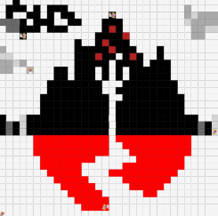

# Unit 1 - Asphalt Art

## Introduction

Cities use asphalt art to improve public safety, inspire their residents and visitors, and brighten communities. Your goal is to create asphalt art to revitalize The Neighborhood and bring the community together with the help of the Painter.

## Requirements

Use your knowledge of object-oriented programming, algorithms, the problem solving process, and decomposition strategies to create asphalt art:
- **Create a new subclass** – Create at least one new subclass of the PainterPlus class that is used for a component of the asphalt art design.
- **Plan an algorithm** – Use the problem solving process and decomposition strategies to plan an algorithm that incorporates a combination of sequencing, selection, and/or iteration.
- **Write a method** – Write at least one method in a PainterPlus subclass that contributes to a component of the asphalt art design.
- **Document your code** – Use comments to explain the purpose of the methods and code segments.

## Notes: Neighborhood & Painter Class

This project was created on Code.org's JavaLab platform using the built-in Neighborhood GUI output. To test and edit this project you must build in Code.org's JavaLab with the Neighborhood GUI enabled. For reference to the Painter class documentation, [you can read more here.](https://studio.code.org/docs/ide/javalab/classes/Painter)

## Output:

## Reflection

1. Describe your project.

   - In this project, we were required to code a program to make a mural on a grid. For my project, I chose to recreate a pixel versiod of the album "With Ears to See and Eyes to Hear" by Sleeping With Sirens. I included various methods to make my art.

2. What are two things about your project that you are proud of?

   - One thing in my project that I am proud of is that I was able to make a method that painted lines of certain lengths and colours based on the input. I am also proud of how quickly I was able to produce my project despite me getting started on it a little later.

3. Describe something you would improve or do differently if you had an opportunity to change something about your project.

   - In my project I had a lot of repeating code. If I had the opportunity to, I would try to shorten the code to make it easier to read, along with making it simpler so I could possibly use the methods I created to make different projects.
